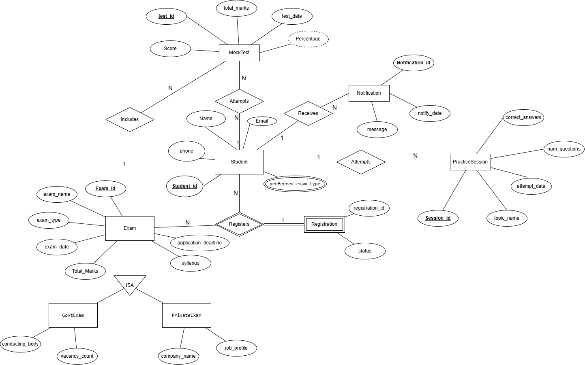
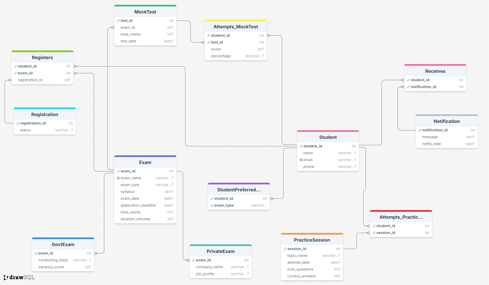

# 🎯 Competitive Exam Preparation & Progress Management System 📊

Welcome to the official repository for my **Database Management System project** built to manage competitive exam preparation, student performance, and progress tracking — with a fully normalized, relational schema and optimized query design.

---

## 📌 Project Overview

This system enables students to:
- 📚 Register for multiple competitive exams
- 📝 Attempt topic-wise practice sessions and full-length mock tests
- 📊 Track their topic-wise and overall progress
- 📬 Receive personalized notifications and reminders

It efficiently manages exam details, exam categories (Govt/Private), registrations, notifications, and derived performance analytics — all within a **clean, normalized PostgreSQL-compatible database**.

---

## 🚀 Key Features

✅ Fully Normalized up to **BCNF**  
✅ Handles **Multivalued Attributes**, **Weak Entities**, and **ISA (Inheritance) Relationships**  
✅ 12 SQL Queries for real-time analytics and reports  
✅ Professional-grade **ER Diagram** and **Relational Schema Diagram**  

---

## 📊 Entity-Relationship (ER) Diagram  



---

## 📖 Relational Schema Diagram  



---

## 📂 Project Structure

```
Competitive-Exam-Progress-Tracker-DBMS/
│
├── 📁 docs/
│   ├── 📄 Project_Report.pdf
│   ├── 📄 Normalisation_and_FDs.pdf
│   ├── 📄 Interview_Summary_Sheet.pdf
│
├── 📁 sql/
│   ├── 📄 DDL.sql
│   ├── 📄 DML.sql
│   ├── 📄 Queries.sql
│
├── 📁 images/
│   ├── 🖼️ ERD.png
│   ├── 🖼️ RelationalSchema.png
│
├── 📄 README.md
```
---

## 📜 Database Highlights

- 📌 `StudentPreferred` — Handles multivalued preferences for exam types  
- 📌 `Registers` — Manages many-to-many Student-Exam registrations  
- 📌 `Attempts_MockTest` / `Attempts_PracticeSession` — Track scores and attempt logs  
- 📌 `GovtExam` / `PrivateExam` — Specialized inheritance tables for exam types  
- 📌 `Receives` — Logs notifications sent to students  
- 📌 `percentage` in MockTest is a **derived attribute** computed at runtime

---

## 📊 Pre-built SQL Queries

✔️ Students registered for exams  
✔️ Students scoring above 80% in mocks  
✔️ Exam registration statistics  
✔️ Preferred vs actual exam registrations  
✔️ Top performers analysis  
✔️ Upcoming exams  
✔️ Govt vs Private exam popularity  
✔️ Practice session analytics and more...

---

## 📙 Documentation

- 📄 Project Report  
- 📄 Normalisation and Functional Dependencies  

All available inside the `/docs/` folder 📂.

---

## 👨‍💻 Author

**Preet Dave**  
🎓 B.Tech Information & Communication Engineering | 2026 Batch  
🔗 [GitHub Profile](https://github.com/DavePreet)

---


